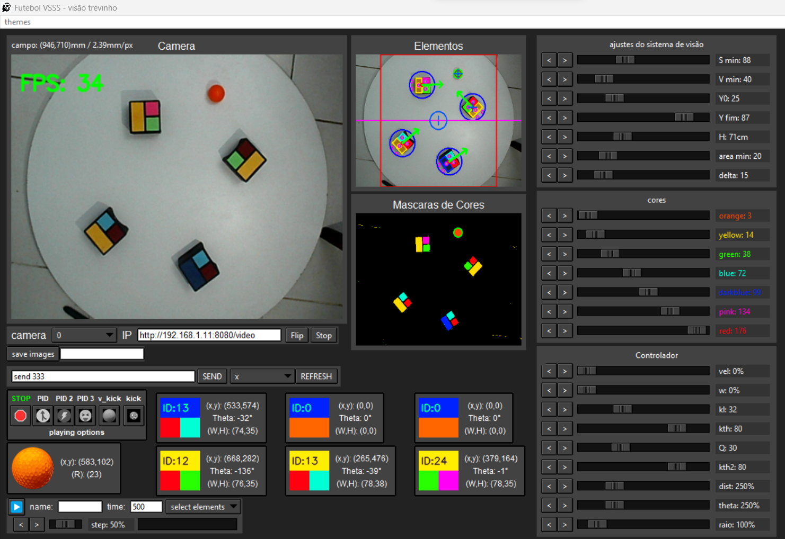

# Futebol_VSSS
Futebol vsss, visão, comunicação, controle e planejamento de trajetorias.

# Bibliotecas:
* Numpy
* OpenCV
* Tkinter
* PySerial

# Modulos deste repositório:
* transmissor.py -> comunicação serial
* controle.py -> classes e funções de controle pid e outros
* vision_thread.py -> Código de visão computacional, funciona em uma thread separada
* widgets.py -> widgets desenvolvidos para a interface gráfica usando Tkinter (Serial/transmissor.py [classe serial_consol])
* main_gui.py -> interface gráfica desenvolvida (widgets.py)
* main.py -> codigo principal do futebol VSSS (datalogger.py, main_gui.py, vision_thread.py, controle.py)

